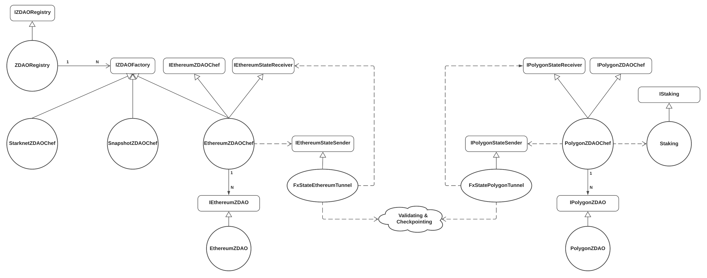

# zDAO contracts for Snapshot and Polygon platform

zDAO supports multiple platforms, e.g. Snapshot, and Polygon.

## Overview

`ZDAORegistry` contains the association of `zNA` and `zDAO`.
Every `zDAO` can have multiple associations with `zNA`s and every `zNA` can be associated to only one `zDAO` if possible.

Every `zDAO` registered in `ZDAORegistry` has a unique id across all the platforms, `ZDAORegistry` has the list of association of `zNA` and `zDAOId`.

`zNA` owner can create `zDAO` in the `ZDAORegistry` through zDAO factories which are registered already in `ZDAORegistry`, inheriting from `IZDAOFactory`.

Every platform should have one `IZDAOFactory` and be registered in `ZDAORegistry`.



### Functionalities of `ZDAORegistry`

- [x] Add ZDAO factory
- [x] Add new `zDAO` through factory
- [x] Remove `zDAO` by admin
- [x] Add/remove `zNA` association.
- [x] Force to add/remove `zNA` association by admin
- [x] Modify `zDAO` by admin

## Development

### Compile

If you ever need to recompile the smart contracts you can run

```
yarn compile
```

To recompile the smart contracts.

> Running yarn compile will also re-generate the typechain helpers

> In some cases you may need to clean previously built artifacts, if you run into errors you can try running yarn build which will clean and re-compile the smart contracts

### Run tests

To run the tests for the smart contracts simply run

```
yarn test
```

You can check test coverage by running

```
yarn coverage
```

> You may get a warning about contract code size exceeding 24576 bytes, you can ignore this.

## Snapshot

Check out the [docs](contracts/snapshot/docs/) folder for more documents.

## Polygon

Check out the [docs](contracts/polygon/docs/) folder for more documents.
