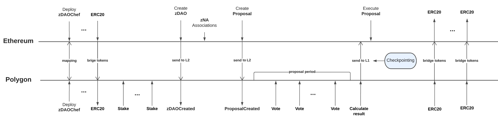
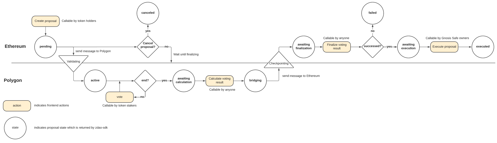

# Voting on Polygon

## Overview

To reduce the gas fees on voting, we decided to use Polygon for voting.

On Ethereum, `zNA` owners can create `zDAO` with:

- zNA: associated `zNA`
- gnosis safe address: address to Gnosis Safe wallet
- voting token: address to ERC20 or ERC721 on Ethereum, token holders can create a proposal.
- amount: minimum number of tokens required to become a proposal creator, proposal should be created on Ethereum as well.
- duration: time duration of proposals in seconds, all the proposals in `zDAO` have the same duration.
- voting threshold: threshold in 100% as 10000 required to check if a given proposal is succeeded,
- minimum voting participants: number of voters in support of a proposal required in order for a vote to succeed
- minimum total voting tokens: number of votes in support of a proposal required in order for a vote to succeed
- relative majority: flag marking if relative majority to calculate a voting result

On Ethereum, voting token holders can create a proposal.

The created `zDAO`s and proposals are automatically synchronized to Polygon, users can cast a vote on Polygon.

- Voting tokens on Ethereum should be mapped to Polygon.
- Users can transfer voting tokens from Ethereum to Polygon through bridges to participate in voting.

  > Goerli to Mumbai: https://wallet-dev.polygon.technology/bridge/

  > Ethereum to Polygon: https://wallet.polygon.technology/bridge/

- Users can get voting power on Polygon as much as they staked mapped voting tokens on Polygon.

- If the proposal ends, the voting result will be transferred to Ethereum for execution.

### Collaboration


Polygon supports transfer states using [PoS](https://docs.polygon.technology/docs/develop/l1-l2-communication/state-transfer) between Ethereum and Polygon.

### Voting Timeline



### Proposal State Changes



The proposal has the following proposal states:

- `pending`: The proposal was created and waiting to be synchronized to Polygon.
- `active`: The proposal was successfully created and synchronized to Polygon, voters can participate in voting.
- `awaiting calculation`: The proposal was ended and ready to calculate the voting result on Polygon and send it to Ethereum.
- `bridging`: The proposal triggered the calculation of the voting result on Polygon and sent it to Ethereum.
- `awaiting finalization`: The calculated voting result arrived on Ethereum and is ready to finalize the result.
- `failed`: The proposal failed on voting.
- `awaiting execution`: The proposal is succeeded in voting and is ready to execute the proposal.
- `executed`: The proposal is successfully executed.

## Deploying

### Pre-requisite

`ZDAORegistry` should be deployed in the working network and be configured in [config.ts](../../scripts/shared/config.ts#L33).

### Deploy

We need to deploy contracts on Ethereum and Polygon and map two contracts for state transfer.

1. Deploy on Ethereum

In the command line terminal, run the following:

```
yarn deploy-polygon:ethereum goerli
```

This command deploys `FxStateEthereumTunnel` and `EthereumZDAOChef`, and registers `EthereumZDAOChef` as `IZDAOFactory` in `ZDAORegistry`.

2. Deploy on Polygon

In the command line terminal, run the following:

```
yarn deploy-polygon:polygon polygonMumbai
```

This command deploys `FxStatePolygonTunnel`, `Staking` and `PolygonZDAOChef`.

## State transfer

[Polygon [docs](https://docs.polygon.technology/docs/develop/l1-l2-communication/state-transfer#overview) explain how State transfer works.

As Polygon docs said, `FxBaseRootTunnel` and `FxBaseChildTunnel` should be mapped.

In our contracts, `FxStateEthereumTunnel` is inherited from `FxBaseRootTunnel`, `FxStatePolygonTunnel` is inherited from `FxBaseChildTunnel`.

- Open Etherscan of `FxStateEthereumTunnel` contract, and call `setPolygonStateTunnel` with the address to `FxStatePolygonTunnel`.
- Open PolygonScan of `FxStatePolygonTunnel`, and call `setEthereumStateTunnel` with the address to `FxStateEthereumTunnel`.

## Token Mapping

zDAO voting supports `ERC20` and `ERC721` as voting power.

To participate in voting, users should bridge `ERC20` and `ERC721` tokens from Ethereum to Polygon and stake on staking contracts before proposal creation.

Check out the [zDAO-token-mapping](https://github.com/zer0-os/zdao-token-mappings).
